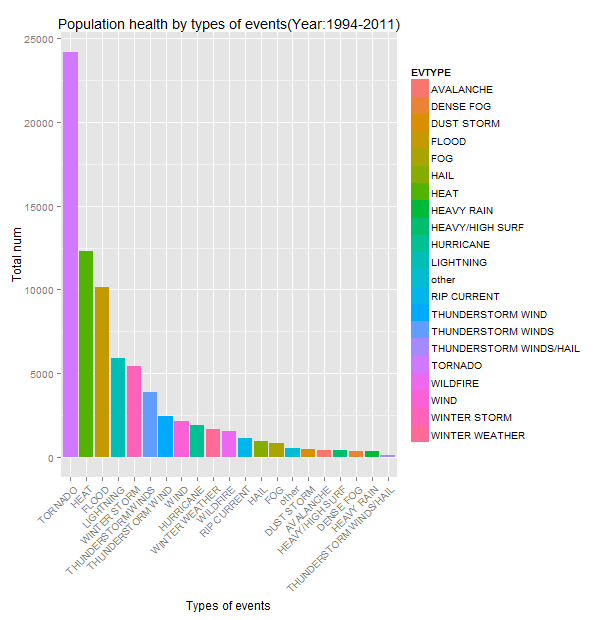
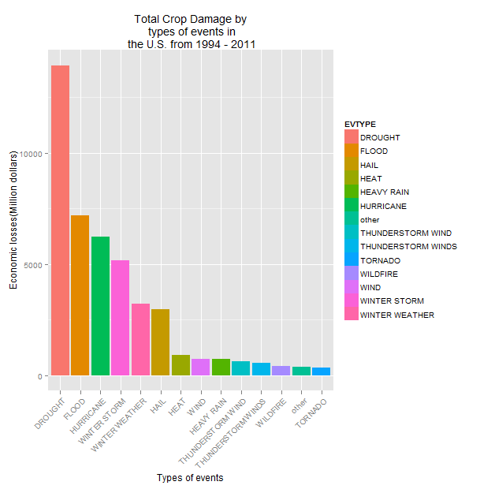
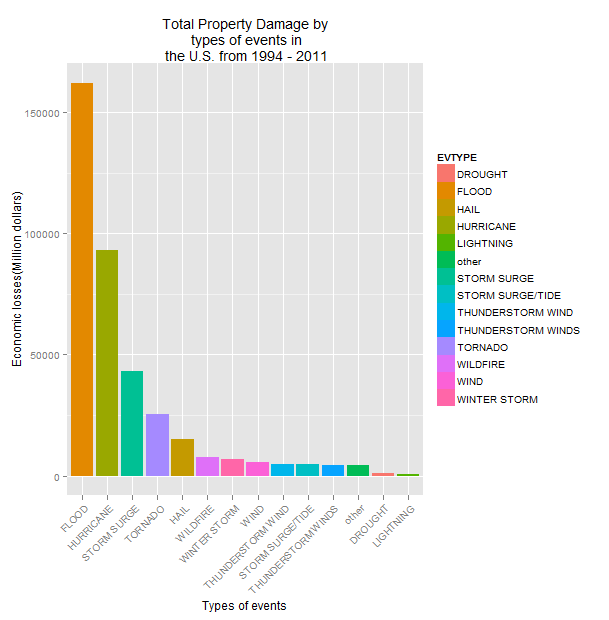

The types of events with major consequences on health and economy
=================================================================

## Synopsis

Storm Data is an official publication of the National Oceanic and Atmospheric Administration (NOAA) which documents the occurrence of storms and other significant weather phenomena having sufficient intensity to cause loss of life, injuries, significant property damage, and/or disruption to commerce.
Natural desatres have become a serious issue in society as a result of climate change. However, the world is not putting the necessary measures to curb climate change. Hurricanes, tornadoes, tropical storms and hurricanes destroy everything in its path, as human lives, animals, crops, houses, etc.
In this report, we aim to analyze the impact of different weather events based on the storm database collected from the U.S. National Oceanic and Atmospheric Administration's (NOAA) from 1950 - 2011. The objective of this study is to determine which types of events are most harmful with respect to population health and have the greatest economic consequences.

## Basic settings

```{r libraries,message=F,cache=F}
setwd("C:/Users/fprado/RepData_PeerAssessment2")
library(knitr)
library(downloader)  # download (hopefully platform independent)
library(tools)  # md5sum
library(R.utils)  # bunzip2
library(data.table)
library(ggplot2)
library(grid)
library(gridExtra)
library(dplyr)
library(plyr)
library(quantmod)
```


## Data Loadind and Processing

Once downloaded the file, we unzip the data file.


```{r read.data,cache=T}
setwd("C:/Users/fprado/RepData_PeerAssessment2")

bunzip2("repdata-data-StormData.csv.bz2",overwrite=T, remove=F)

FileData <- "C:/Users/fprado/RepData_PeerAssessment2/repdata-data-StormData.csv"

data <- read.csv(FileData, header=TRUE,as.is = TRUE, sep=",")
```


### Get the cleaned data

The events in the database start in the year 1950 and end in November 2011. In the earlier years of the database there are generally fewer events recorded, most likely due to a lack of good records. More recent years should be considered more complete.

To purge the database we will extract the year of BGN_DATE variable, and select the variables that they go into the studio.

```{r count.events.by.year}

head(data)

summary(data)

library(dplyr)
library(chron)
library(lubridate)

year <- year(mdy_hms(data$BGN_DATE))

data <- cbind(data,year)

data_clean <- subset(data,select = c(year,EVTYPE,FATALITIES,INJURIES,PROPDMG,PROPDMGEXP,CROPDMG,CROPDMGEXP))
```

Perform the histogram to detect the years with major events, and we see that the number of events tracked starts to significantly pick up around 1994.

```{r clean.year}

hist(data$year, breaks = 60)

data1 <- data_clean[data_clean$year >= 1994,]

```


### Cleaning and standardizing event types (EVTYPE)

Cleaning and standardizing event types (EVTYPE)

The variable EVTYPE consists of 985 levels. Therefore, we will group them into categories to reduce levels.

```{r count.events}
data1$EVTYPE[grep("HURRICANE|TYPHOON|TROPICAL", data1$EVTYPE)] <- "HURRICANE"
data1$EVTYPE[grep("HEAVY RAIN/SEVERE WEATHER|EXCESSIVE RAINFALL|UNSEASONAL RAIN","HEAVY RAINS", data1$EVTYPE)] <- "HURRICANE"
data1$EVTYPE[grep("WILD/FOREST FIRE|WILDFIRES|WILD FIRES", data1$EVTYPE)]<- "WILDFIRE"
data1$EVTYPE[grep("HEAT", data1$EVTYPE)]<- "HEAT"
data1$EVTYPE[grep("COLD|FROST|FREEZE", data1$EVTYPE)]<- "COLD"
data1$EVTYPE[grep("HIGH WINDS|HIGH WIND|BLOWING WIND|STRONG WINDS|STRONG WIND", data1$EVTYPE)]<- "WIND"
data1$EVTYPE[grep("FLASH|FLOOD|FLOODING|FLOOD|FLD|RECORD RAINFALL", data1$EVTYPE)]<- "FLOOD"
data1$EVTYPE[grep("LIGHTNING|LIGHTING|LIGNTNING", data1$EVTYPE)] <- "LIGHTNING"
data1$EVTYPE[grep("HEAVY SURF|HIGH SURF", data1$EVTYPE)] <- "HEAVY/HIGH SURF"
data1$EVTYPE[grep("SNOW|ICE|BLIZZARD|WINTER STORM|FREEZING|WINTRY MIX|SLEET", data1$EVTYPE)] <- "WINTER STORM"
data1$EVTYPE[grep("WINTER WEATHER|COLD|ICY|GLAZE|LOW TEMPERATURE|HYPOTHERMIA|HYPERTHERMIA|COLD TEMPERATURE|WINDCHILL", data1$EVTYPE)] <- "WINTER WEATHER"
data1$EVTYPE[grep("SLIDE", data1$EVTYPE)] <- "SLIDES"
data1$EVTYPE[grep("RIP", data1$EVTYPE)] <- "RIP CURRENT"
data1$EVTYPE[grep("THUNDERSTORM WIND|THUNDERSTORMS WIND|THUNDERSTORMW|THUNDERSTORMWINDS|THUNDERSTORM WINS|TSTMW", data1$EVTYPE)] <- "THUNDERSTORM WIND"
data1$EVTYPE[data1$EVTYPE == "WINDS" | data1$EVTYPE == "WIND"]  <- "WIND"
data1$EVTYPE <- gsub("THUNDEERSTORM|THUNDERESTORM|THUNDERSTROM|THUDERSTORM|THUNERSTORM|THUNDERTORM|TUNDERSTORM|TSTM WIND|TSTM WIND|SEVERE THUNDERSTORM WINDS|THUNDERSTORM WINDS","THUNDERSTORM WINDS", data1$EVTYPE)
```

The categories that have a lower frequency of 50 is recoded as "Other".

```{r count.events.50}
cat_event <- sort(table(data1$EVTYPE), decreasing = TRUE)

cat_event_under50 <- names(cat_event[cat_event < 50])

data1$EVTYPE[data1$EVTYPE %in% cat_event_under50] <- "other"

sort(table(data1$EVTYPE), decreasing = TRUE)

```

Now there are 38 levels.

### Computing damage values.

#### Property Damage.

We will convert the property damage and crop damage data into comparable 
numerical forms according to the meaning of units described in the code book 
(Storm Events). Both  PROPDMGEXP  and  CROPDMGEXP  columns record a multiplier 
for each observation where we have Hundred (H), Thousand (K), Million (M) and 
Billion (B).

The option useNA="ifany" requests to report missing values.

```{r}
table(data1$PROPDMGEXP, useNA = "ifany")

data1$PROPDMGEXP = as.character(data1$PROPDMGEXP)
```

Put all capital letters in the variable PROPDMGEXP.

```{r convert.units.prop,warning=F}
data1$PROPDMGEXP <- toupper(data1$PROPDMGEXP)
data1$PROPDMGEXP[data1$PROPDMGEXP == 'B'] = "9"
data1$PROPDMGEXP[data1$PROPDMGEXP == 'M'] = "6"
data1$PROPDMGEXP[data1$PROPDMGEXP == 'K'] = "3"
data1$PROPDMGEXP[data1$PROPDMGEXP == 'H'] = "2"
data1$PROPDMGEXP = as.numeric(data1$PROPDMGEXP)
data1$PROPDMGEXP[is.na(data1$PROPDMGEXP)] = 0
data1$PROPDMG[is.na(data1$PROPDMG)] = 0
data1$PropertyDamage = data1$PROPDMG * 10^data1$PROPDMGEXP
summary(data1$PropertyDamage)
```


#### Crop Damage.

The option useNA="ifany" requests to report missing values.

```{r}
table(data1$CROPDMGEXP, useNA = "ifany")
data1$CROPDMGEXP = as.character(data1$CROPDMGEXP)
```

Ponemos todas las letras en mayúsculas en la variable CROPDMGEXP.

```{r convert.units.crop,warning=F}
data1$CROPDMGEXP <- toupper(data1$CROPDMGEXP)
data1$CROPDMGEXP[data1$CROPDMGEXP == 'B'] = "9"
data1$CROPDMGEXP[data1$CROPDMGEXP == 'M'] = "6"
data1$CROPDMGEXP[data1$CROPDMGEXP == 'K'] = "3"
data1$CROPDMGEXP[data1$CROPDMGEXP == 'H'] = "2"
data1$CROPDMGEXP = as.numeric(data1$CROPDMGEXP)
data1$CROPDMGEXP[is.na(data1$CROPDMGEXP)] = 0
data1$CropDamage = data1$CROPDMG * 10^data1$CROPDMGEXP
summary(data1$CropDamage)
```

# Results.


## Across the United States, which types of events are most harmful with respect to population health?

As for the impact on public health, we have got two sorted lists of severe weather events below by the number of people badly affected. Therefore, we add the variables Fatalities and Injuries. Then we select the types of events that are more and as many 100 people.


```{r most.harmful.evtypes}

data1$TotalPeople = data1$INJURIES + data1$FATALITIES 

field <- aggregate(data1[,"TotalPeople"], by = list(data1$EVTYPE), FUN = "sum")

names(field) <- c("EVTYPE", "TotalPeople")
field <- arrange(field, field[, 2], decreasing = T) 
field1<-field[field$TotalPeople>=100,]

png("plot_health.png", width=609, height=620)

ggplot(field1, aes(x = reorder(EVTYPE,-TotalPeople),y = TotalPeople, fill = EVTYPE))+
  geom_bar(stat = "identity")+theme(axis.text.x = element_text(angle = 45,hjust = 1))+
  xlab("Types of events")+ylab("Total num")+ggtitle("Population health by types of events(Year:1994-2011)")

dev.off()
```

### Plot Population Health.

 


## Across the United States, which types of events have the greatest economic consequences?


### Crop Damage.

We can now see which event types are particularly dangerous or particularly costy by crop damage.

We narrow down to the top 14.

```{r crop.damage.evtypes}

Crop_Damage <- aggregate(data1[,"CropDamage"], by = list(data1$EVTYPE), FUN = "sum")

names(Crop_Damage) <- c("EVTYPE", "CropDamage")
Crop_Damage <- arrange(Crop_Damage, Crop_Damage[, 2], decreasing = T) 
Crop_Damage1<-head(Crop_Damage,n=14)

png("plot_cropdamage.png", width=609, height=620)

ggplot(Crop_Damage1, aes(x = reorder(EVTYPE, -CropDamage),y = CropDamage/10^6, fill = EVTYPE))+geom_bar(stat = "identity")+
  theme(axis.text.x = element_text(angle = 45,hjust = 1))+xlab("Types of events")+ylab("Economic losses(Million dollars)")+
  ggtitle("Total Crop Damage by\n types of events in\n the U.S. from 1994 - 2011")

dev.off()
```

#### Plot Crop Damage.

 


### Property Damage.

We can now see which event types are particularly dangerous or particularly costy by property damage.

We narrow down to the top 14.

```{r property.damage.evtypes}
Property_Damage <- aggregate(data1[,"PropertyDamage"], by = list(data1$EVTYPE), FUN = "sum")

names(Property_Damage) <- c("EVTYPE", "PropDamage")
Property_Damage <- arrange(Property_Damage, Property_Damage[, 2], decreasing = T) 
Property_Damage1<-head(Property_Damage,n=14)

png("plot_propdamage.png", width=609, height=620)

ggplot(Property_Damage1, aes(x = reorder(EVTYPE, -PropDamage),y = PropDamage/10^6, fill = EVTYPE))+geom_bar(stat = "identity")+
  theme(axis.text.x = element_text(angle = 45,hjust = 1))+xlab("Types of events")+ylab("Economic losses(Million dollars)")+
  ggtitle("Total Property Damage by\n types of events in\n the U.S. from 1994 - 2011")

dev.off()
```

#### Plot Property Damage.

 

# Conclusion.

The results of this study reveal that tornadoes and heat are most harmful types of events with respect to population health. 
On the other hand, we have flood and hurricanes are events with the greatest economic consequences in property damage, while drought, flood and hurricane 
cause the greatest damage to property.


